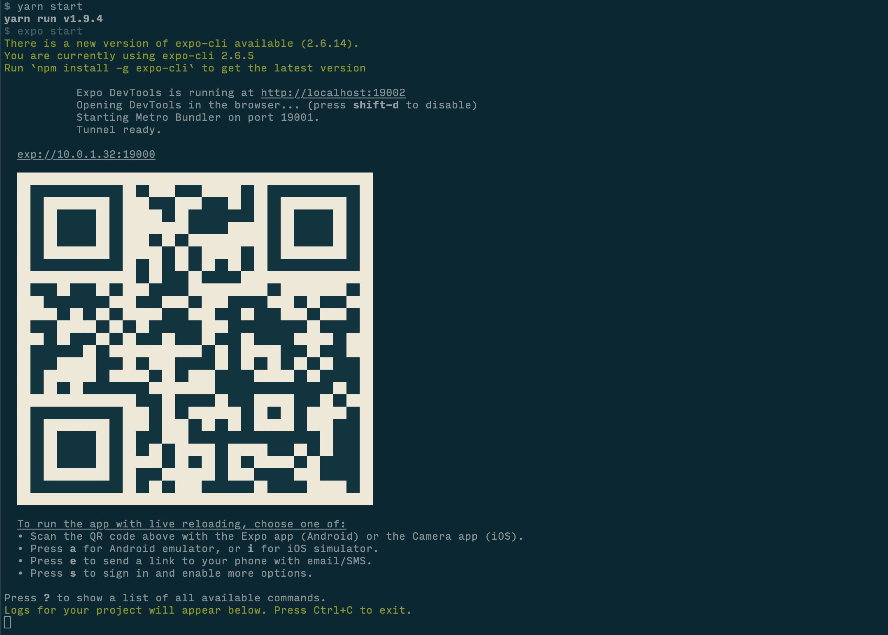

# Isaax Native

## Background

This app was written as a prototype for Isaax's [advent calendar](https://qiita.com/advent-calendar/2018/isaax) 2018.
The goal was to create an app that uses Isaax's public api that will allow someone to stop, start and restart their running applications.

I plan to continue work on this app passed the scope of the advent calendar challenge to make it as full featured as the isaax dashboard itself as I could image this app being useful as a console for managing projects or devices that requires no user log in.

## Implementation

### React Native and Expo

React Native is a framework for building native applications with React. I have used React a lot in the past for creating web applications and wanted to try out React Native.

To bootstrap the project I used [expo](https://expo.io/). The expo SDK adds a lot of extra functionality that is not baked into react-native and also allows you to use the expo app on any device you want to test with.

It is easy to install expo and bootstrap a project

```bash
npm install -g expo-cli
expo init isaax-native
```

You can then cd into the project folder and `yarn start` the application. A QR code will appear in the terminal which you can scan, this will open your project in the expo app and allow you to debug easily.



### Hooks

I was interested in Reacts new [hooks](https://reactjs.org/docs/hooks-intro.html) feature and wanted to write something that utilizes them.

Hooks are a new upcoming feature in react that in theory solve a lot of problems that are usually encountered when writing React projects. But don't let me tell you, just watch [this](https://www.youtube.com/watch?v=dpw9EHDh2bM&feature=youtu.be) video from react-conf that explains the benefits of hooks.

I only used two hooks `useState` and `useEffect` in this project, but just using these two forced me into thinking about using react in a different way, without classes.

We can see below an example of where both hooks are used to render the list of projects.

```jsx
function ProjectList(props) {
    const {navigate} = props.navigation;
    const [projects, setProjects] = useState([]);

    useEffect(() => {
        api.get('/projects')
        .then((response) => {
            setProjects(response)
        })
    }, []);

    return (
        <ScrollView style={styles.container}>
            {projects.map(project => {
                return (
                <TouchableHighlight
                    key={project.id}
                    onPress={() => navigate('ProjectDetails', {id: project.id})}
                >
                    <View style={styles.card}>
                        <Text style={styles.cardText}>{project.name}</Text>
                    </View>
                </TouchableHighlight>
                )
            })}
        </ScrollView>
    )
}
```

#### useState

`useState` aims to solve the problem of sharing state across functional components.
We destructure `useState`, which just returns a state and a [function](https://reactjs.org/docs/hooks-reference.html#usestate) and we set it's initial value to be an empty array.

#### useEffect

`useEffect` adds the ability to perform side effects from a function component. It serves the same purpose as `componentDidMount`, `componentDidUpdate`, and `componentWillUnmount` in React classes, but unified into a single API. So you can see here I am fetching the users using the API and then using the `setProjects` function we created earlier to save them in our state. As `useEffect` runs every render by default we add a `[]` as the second parameter. This means that we only want it to run on mount and unmount. If we wanted it to run every time our projects changed we could add `[projects]` as the second parameter.

## Results

So what actually happens on the device when we issue commands. We can check the logs on the device to see the output. Isaaxd logs are found at `/var/logs/isaaxd.log`

Stop

The section in red here shows the stop command being received and executed.


Start

The section in red here shows the start command being received and executed.
The green section shows the application restarting and the first logs from the application being printed.


Restart

The section in red here shows the restart command being received and executed.
The green section shows the application restarting and the first logs from the application being printed.

