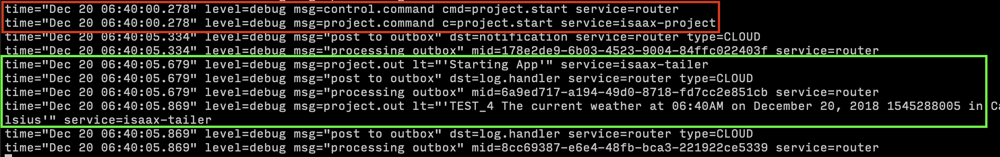

# Isaax Native

## Background

This app was written as a prototype for Isaax's [advent calendar](https://qiita.com/advent-calendar/2018/isaax) 2018.
The goal was to create an app that uses Isaax's public api that will allow someone to stop, start and restart their running applications.

I plan to continue work on this app passed the scope of the advent calendar challenge to make it as full featured as the isaax dashboard itself as I could image this app being useful as a console for managing projects or devices that requires no user log in.

### Hooks

I was interested in Reacts new [hooks](https://reactjs.org/docs/hooks-intro.html) feature and wanted to write something that utilizes them.

Hooks are a new upcoming feature in react that in theory solve a lot of problems that are usually encountered when writing React projects. But don't let me tell you, just watch [this](https://www.youtube.com/watch?v=dpw9EHDh2bM&feature=youtu.be) video from react-conf that explains the benefits of hooks.

### Results

Stop

Start

